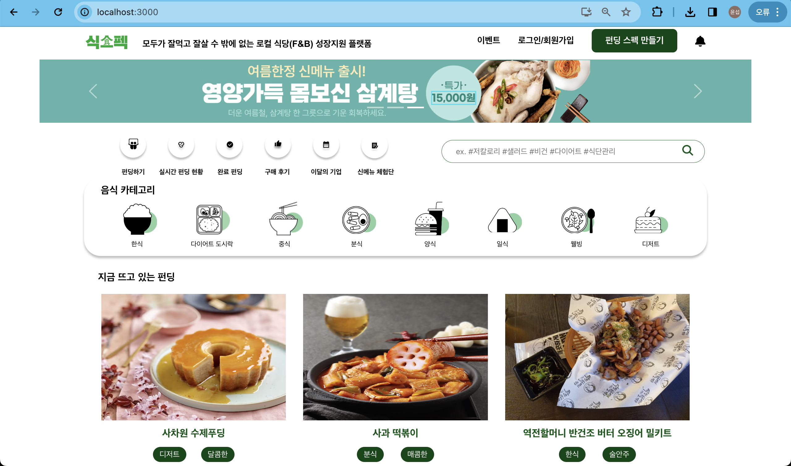
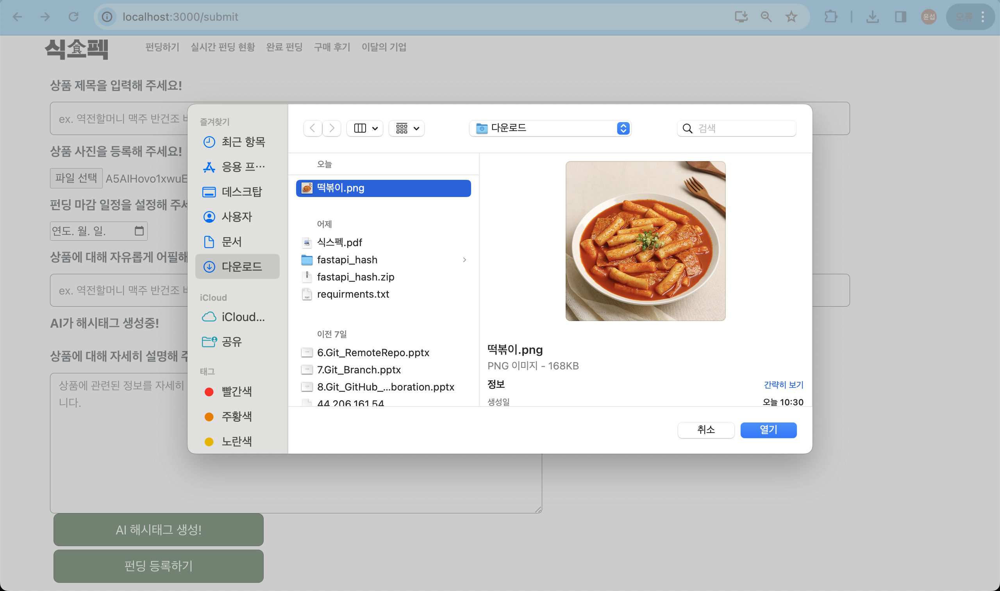
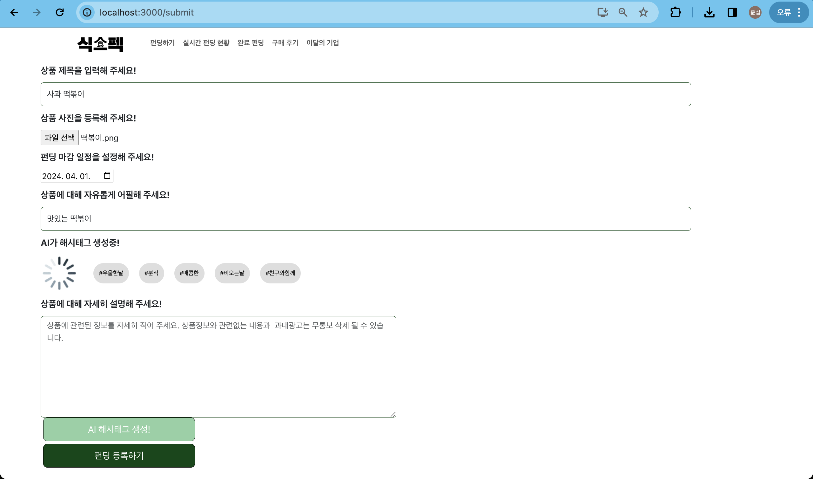
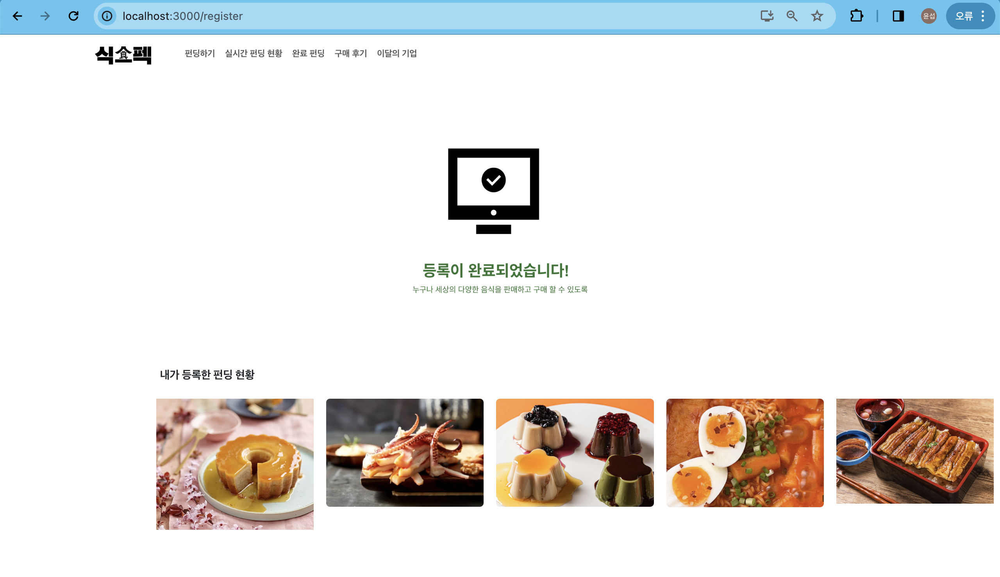
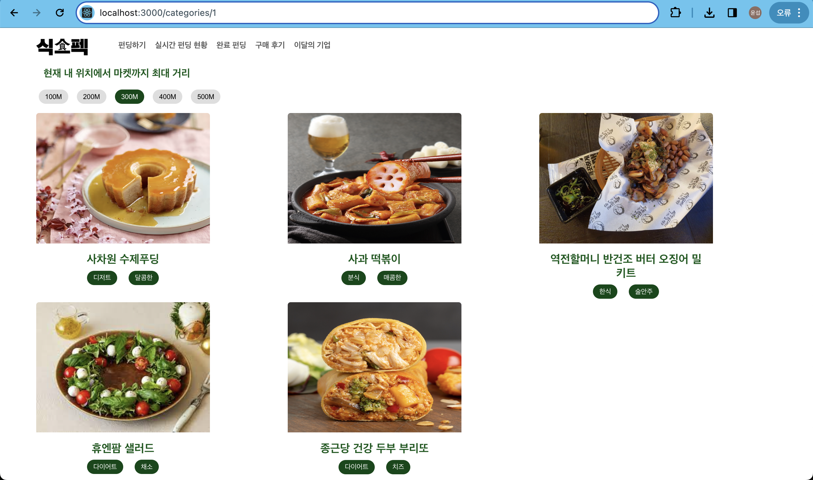
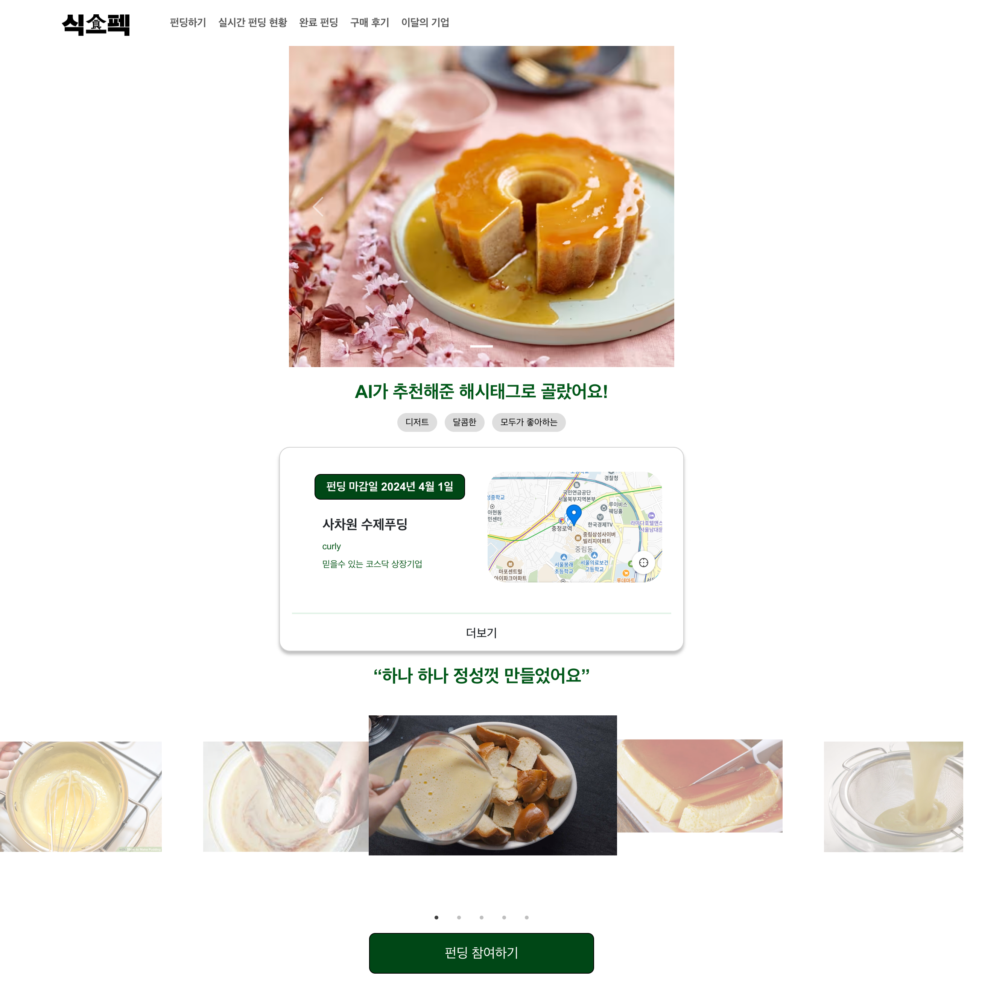
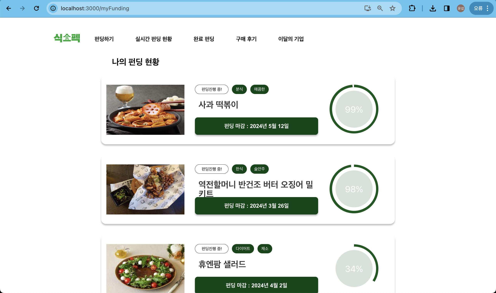

# goormthon-Univ-2024_BEOTKKOTTHON_TEAM_26_FE

##### 🌸구름톤 univ에서 만난 6명의 육각형 인재들이 만든 프로젝트 "식스펙"

---

### 식(食)스펙이란?

---
**"음식도 스펙이다"**
소상공인분들의 부담을 덜고자 누구나 음식도 스펙으로 만들 수 있다는 슬로건

누구나 부담없이 접할 수 있는 "무지출 펀딩"이라는 방식을 통하여  
다음과 같은 효과로 로컬 식당 지원, 소비자 선택지 증가, 지역경제 활성화의 세마리의 토끼를 잡을 수 있음

빠르고 간편한 홍보, 수요조사 -> 사장님 새로운 시도를 환경마련 -> 펀딩 성공 -> 지역 먹거리 인프라 활성화 -> 향상된 인프라를 누리는 소비자

<h3 align="center">    주요기능 </h3>

---

 
메인화면

---

펀딩스펙을 만드는 화면, ai 해시태그 생성을 위해 이미지와 설명을 넣을 수 있습니다.

---

 
관련 해시태그가 생성된 모습

---

 
사용자가 등록한 펀딩 목록을 볼 수 있습니다.

---

 
거리를 설정하여 근처에서 진행되는 음식 펀딩을 볼 수 있습니다.

---

 
상세페이지

---

 
사용자가 참여한 펀딩 목록을 볼 수 있습니다.

---

<h3 align="center">    🧑🏻‍💻👩🏻‍💻 TEAM </h3>

|                        FE                        |                       FE                        |
|:------------------------------------------------:|:-----------------------------------------------:|
|                      한성대학교                       |                     동덕여자대학교                     |
|                       김윤섭                        |                       권지민                       |
| 🥃 [yoonseopkim](https://github.com/yoonseopkim) | 🐨 [KoalaJimin](@https://github.com/KoalaJimin) |
|     초기세팅, 카테고리, 상세페이지, 등록완료, ai해시태그생성(공동작업)      |    홈, 나의 펀딩현황, 펀딩완료, 펀딩스펙만들기, ai해시태그생성(공동작업)    | 

<h3 align="center">   기술 스택 </h3>

---

 

   

  

  
  

 

  

<h3 align="center">   📜 Commit Message Convention </h3>

---

Commit Type

➕ [ADD] : 코드 추가 및 라이브러리 추가, 새로운 파일 생성

✨ [FEAT] : 새로운 기능 구현

✅ [MOD] : 코드 및 내부 파일 수정

🧱 [CHORE] : 문법 오류 해결, 타입 변경, 파일 이름 변경 등의 사소한 코드 및 파일 수정

🗑 [DEL] : 쓸모없는 코드나 파일 삭제

📄 [DOCS] : README 등의 문서 개정

🚚 [MOVE] : 프로젝트 파일 및 코드 이동

🔀 [MERGE] : 다른 브랜치와의 충돌 해결 후 Merge

♻ [REFACTOR] : 전면 수정

🛠 [SETTING] : 기타 설정

### Commit Message

- [Commit Type] Commit Explanation
ex ) [FEAT] 회원가입 기능 구현
Pull Request

### PR 목적 한 문장 정리
- 피드백 요청 시 원하는 시점, 피드백 방향 명시
- Lable 태그 달기 (작업중, 이름)

